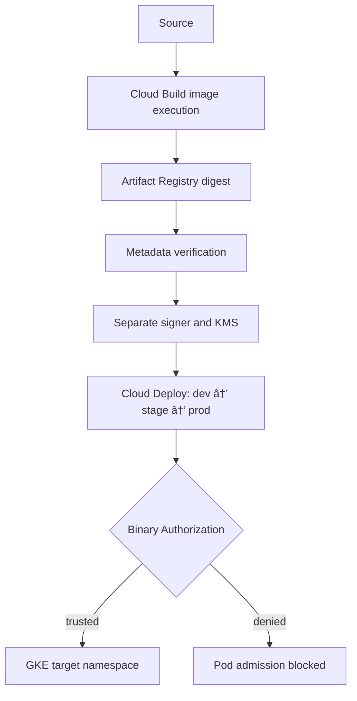

# Secure Delivery Platform

A Google-native delivery platform promoting one verified, attested image digest through dev, stage, and prod. Build, signing, and deployment authority remain separate.

Cloud Deploy orchestrates existing trusted artifacts; Binary Authorization remains admission authority. Stage and prod require separate approval. Promotion never rebuilds, retags, or replaces the artifact.

The implemented path includes metadata verification, digest-bound attestation, enforced admission, protected source/render storage, and controlled promotion. Manual readiness and internal HTTP checks validate deployments. Application dashboards, alert-driven promotion, and automated rollback remain planned.

## Validated delivery path

End-to-end controlled promotion was validated: the same verified and attested release progressed through `dev → stage → prod` without rebuilding or replacing the artifact. This is a validation snapshot, not a live infrastructure or status dashboard.

See [Controlled Promotion Validation](docs/trusted-delivery.md#controlled-promotion-validation) for the approval flow and the surrounding identity, trust, admission, and health checks.

## Repository structure

| Area | Responsibility |
| --- | --- |
| `app/` | Minimal sample service |
| `cloudbuild/` | Image, verification, and separate signing execution |
| `deploy/` | Shared manifests, consumer, and Cloud Deploy preparation |
| `terraform/` | Reproducible foundation |
| `monitoring/` | Planned operational visibility assets/notes |
| `docs/` | Canonical architecture, contracts, and operations |

## Documentation

- [Architecture Overview](docs/architecture/overview.md)
- [Release Model](docs/architecture/release-model.md)
- [Trusted Delivery](docs/trusted-delivery.md)
- [Controlled Promotion Validation](docs/trusted-delivery.md#controlled-promotion-validation)
- [Environment Policies](docs/architecture/environment-policies.md)
- [IAM Model](docs/iam-model.md)
- [Operator Runbook](docs/operator-runbook.md)
- [MVP Boundaries](docs/architecture/mvp-boundaries.md)
- [Observability](docs/observability.md)
- [Architecture Diagrams](docs/diagrams/README.md)
- [Roadmap](docs/roadmap.md)

The architectural roadmap is not a deployment progress tracker. One project/cluster and three namespaces keep the MVP small; namespace routing is not strong IAM/RBAC isolation.
