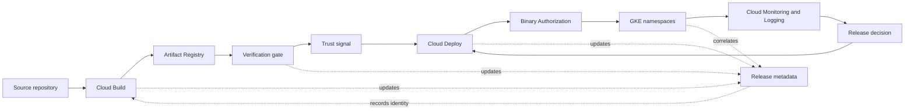
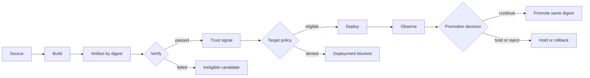
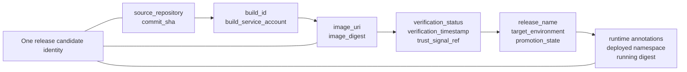
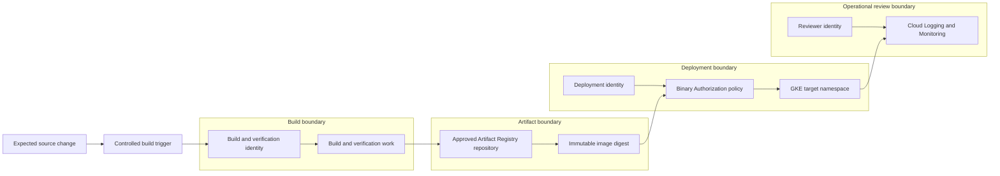
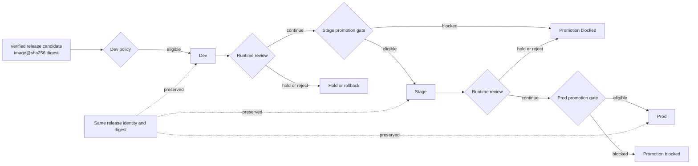

# Architecture Diagrams

This page is the visual index for the Secure Delivery Platform architecture.

The diagrams describe the canonical design and trust model, not the current deployment state. The Trusted Release Model defines the architecture; the executable foundation, trust enforcement, controlled promotion, and operational visibility are implemented incrementally according to the roadmap.

For the detailed design, see the [Architecture Overview](../architecture/overview.md), [Release Metadata Contract](../architecture/release-metadata.md), [Trust Model](../architecture/trust-model.md), and [Environment Policies](../architecture/environment-policies.md).

## Platform architecture

This diagram shows the intended Google Cloud component boundaries and the direction of release and operational evidence.

## Trusted release path

The release path separates artifact creation from deploy eligibility. A failed verification or policy evaluation stops progression without changing the candidate identity.

## Release identity and metadata flow

Canonical snake_case metadata fields connect each stage. Kubernetes annotations use the `release.secure-delivery.dev` namespace and map back to these canonical keys.

## Trust boundaries and service identities

The MVP separates production of an artifact from authority to deploy it. Operator access is read-oriented, while infrastructure provisioning remains a separate administrative responsibility.

## Environment promotion flow

Promotion preserves the release identity and immutable digest. Each target applies its own policy and runtime review before the next explicit promotion.

