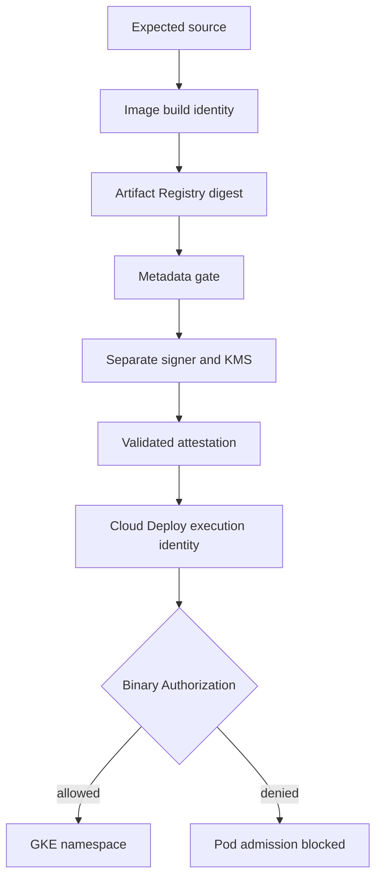
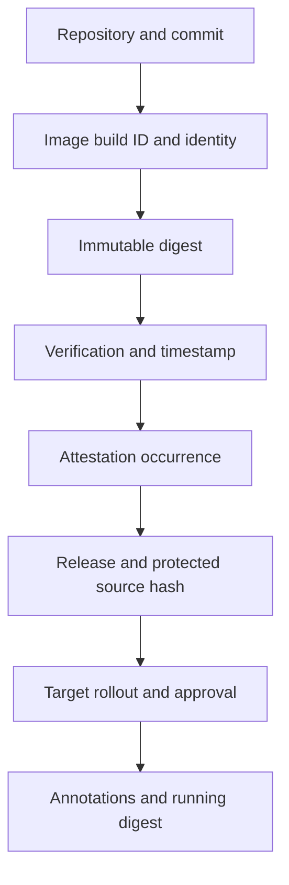
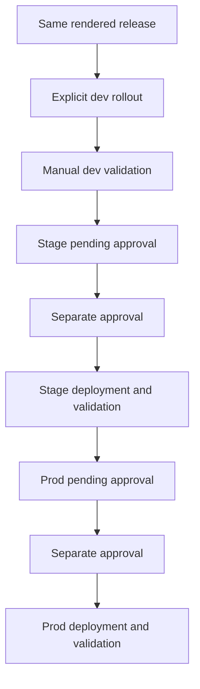

# Architecture Diagrams

Visual summaries of [Architecture Overview](../architecture/overview.md), [Release Model](../architecture/release-model.md), [Environment Policies](../architecture/environment-policies.md), and [IAM Model](../iam-model.md), without redefining contracts.

## Trusted delivery

```mermaid
flowchart TB
    Source[Expected source] --> Build[Image build identity]
    Build --> Registry[Artifact Registry digest]
    Registry --> Verify[Metadata gate]
    Verify --> Sign[Separate signer and KMS]
    Sign --> Trust[Validated attestation]
    Trust --> Deploy[Cloud Deploy execution identity]
    Deploy --> Admission{Binary Authorization}
    Admission -->|allowed| Runtime[GKE namespace]
    Admission -->|denied| Stop[Pod admission blocked]
```

Cloud Build executes distinct jobs; shared execution service does not combine authority. Orchestration precedes admission.

## Identity correlation

```mermaid
flowchart TB
    Source[Repository and commit] --> Build[Image build ID and identity]
    Build --> Digest[Immutable digest]
    Digest --> Verification[Verification and timestamp]
    Verification --> Trust[Attestation occurrence]
    Trust --> Release[Release and protected source hash]
    Release --> Rollout[Target rollout and approval]
    Rollout --> Runtime[Annotations and running digest]
```

Rollout state changes; artifact identity does not. Release Model owns field mapping.

## Controlled promotion

```mermaid
flowchart TB
    Release[Same rendered release] --> Dev[Explicit dev rollout]
    Dev --> Review[Manual dev validation]
    Review --> StagePending[Stage pending approval]
    StagePending --> StageApproval[Separate approval]
    StageApproval --> Stage[Stage deployment and validation]
    Stage --> ProdPending[Prod pending approval]
    ProdPending --> ProdApproval[Separate approval]
    ProdApproval --> Prod[Prod deployment and validation]
```

All targets share admission. Render-all is not rollout-all; approval is separate from promotion. Failure means stop; rollback is not automatic. See [Controlled Promotion Validation](../trusted-delivery.md#controlled-promotion-validation).

## Planned visibility

```mermaid
flowchart LR
    Runtime[Release context] -. planned .-> Signals[Application logs and metrics]
    Signals -. planned .-> Review[Dashboards and alerts]
```

These [Observability](../observability.md) capabilities are planned, not implemented promotion gates.
