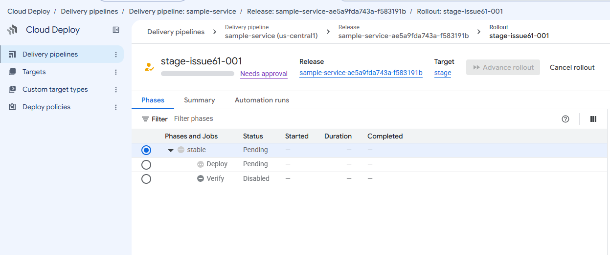
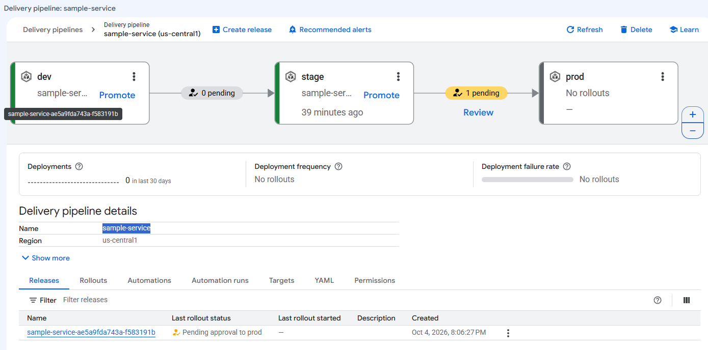
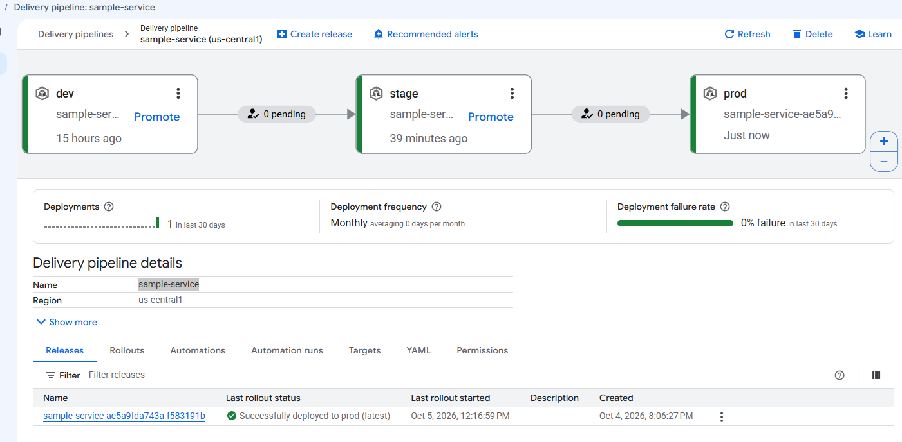

# Trusted Delivery

## Delivery path

```text
Verified release candidate → Trust → Cloud Deploy → Binary Authorization → GKE target namespace
```

Image production, metadata verification, signing, orchestration, and admission have separate responsibilities. Cloud Build executes distinct image and signing jobs under different identities. Cloud Deploy renders/deploys an existing trusted digest through the deployment identity. Binary Authorization remains admission authority. [Release Model](architecture/release-model.md) owns contracts; [Operator Runbook](operator-runbook.md) owns procedures.

## Verification

`cloudbuild/cloudbuild-verify.yaml` runs `cloudbuild/scripts/verify-release-metadata.py`. Supply producer JSON as `release-metadata.json` with reviewed scripts; `_METADATA_FILE` selects another source-relative file. The producer logs JSON; transport remains an explicit handoff.

Trusted configuration supplies `PROJECT_ID`, `_LOCATION`, and `_REPOSITORY`, never candidate metadata. Checks cover six nonempty initial fields, `owner/repo`, lowercase full Git SHA, UUID-shaped build ID, service-account identity, lowercase SHA-256, and exact approved registry path. A tagged producer input can yield pinned `artifact_identity`; pinned input must agree with `image_digest`.

Missing files, malformed/duplicate JSON, foreign registry, invalid identities, and digest mismatch fail with exit 1. Handled outcomes emit status, UTC timestamp, and errors. Input verification/trust claims are ignored. This gate does not prove provenance, source authorization, artifact existence, or tag binding. Failure stops signing/promotion and retains diagnostics without substituting another artifact.

```sh
python cloudbuild/scripts/verify-release-metadata.py \
  --metadata release-metadata.json \
  --approved-registry us-central1-docker.pkg.dev/<PROJECT_ID>/secure-delivery
python -B -m unittest discover -s scripts/tests -p test_release_metadata_verification.py -v
```

## Attestation

`cloudbuild/cloudbuild-attest.yaml` executes `cloudbuild/scripts/attest-release.py` as `<ATTESTATION_SERVICE_ACCOUNT>`. It reruns verification in trusted execution; uploaded verification output is not authorization. Rejection stops before credentials, signing, or writes.

The standard Binary Authorization simple-signing payload binds the immutable subject. KMS signs its exact SHA-256; private key bytes never leave KMS. `validateAttestationOccurrence` must return `VERIFIED` before creation. Readback matches subject, note, key ID, and payload and validates the signature again.

`--key-version` is the bare `projects/.../cryptoKeyVersions/1` KMS request resource. `--public-key-id` is the canonical `//cloudkms.googleapis.com/v1/projects/.../cryptoKeyVersions/1` occurrence/validation URI. Both must identify the same version. Terraform `attestation_key_version` is the canonical URI, not the KMS API name. Custom aliases are unsupported; rotation must update both inputs and the registered attestor key.

Success emits `attestation_status=created`, artifact identity, fresh verification, and occurrence `trust_signal_ref`. Failure emits failed status/error without a trust reference. A failure after creation can leave an occurrence; inspect before retrying. Retries can produce duplicates for one digest.

Assemble signing code/config from a reviewed immutable commit; copy only candidate JSON. Do not accept candidate-controlled scripts or reuse the image trigger. Submission/source upload/signer `actAs` need separate reviewed authority. The signer cannot publish images, deploy, or administer admission policy. Persistent key-ring names and protected key lifecycle require deliberate review. Builds, KMS, logs, and storage incur charges.

`--inspect-only` matches subject/note/key and validates signatures without signing/writes. Reviewer occurrence-viewing/attestor-verification access is separate from signing. See [IAM Model](iam-model.md) and [inspection procedure](operator-runbook.md#attestation-inspection).

## Cloud Deploy orchestration and rendering

One pipeline uses serial dev/stage/prod profiles. Targets reference `projects/<PROJECT_ID>/locations/us-central1-a/clusters/<GKE_CLUSTER>`. Namespace selection is in manifests; GKE targets have no namespace field. RENDER and DEPLOY use `<DEPLOY_SERVICE_ACCOUNT>`, default Cloud Build workers, and required Google-managed agents.

`deploy/clouddeploy/prepare-release.py` reuses the existing consumer validation, `deploy/environments.json`, and shared manifests. It validates the input target and all target views before writing, never overwrites a bundle, and makes no subprocess/cloud calls. Only namespace, environment annotation, and `APP_ENV` vary.

Release creation renders all serial targets. `--disable-initial-rollout` prevents initial deployment; stage/prod rendering creates no rollouts or workloads. Pinned raw manifests need no `--images` or `--build-artifacts` substitution. Source has no application build stanza, hooks, or image overrides. Generated/default effective Skaffold `build.local` and `tagPolicy.gitCommit` alone do not prove rebuilding: inspect actual execution and rendered/running digest for build, retag, or substitution.

## Source and rendered artifact protection

`gs://<CLOUD_DEPLOY_BUCKET>` uses STANDARD in `us-central1`, uniform bucket-level access, enforced public access prevention, disabled versioning, and `force_destroy=false`. Unlocked 86400-second retention prevents byte overwrite/delete during that period. Administrators can change the policy; it is not an irreversible lock.

Source uses `source/<release-name>/`; outputs use `rendered/dev`, `rendered/stage`, and `rendered/prod`. Prefixes are not IAM boundaries. Target `artifact_storage` does not configure source staging; creation separately supplies `--gcs-source-staging-dir`.

The caller uploads; deploy execution reads source and writes/reads outputs through Cloud Build. Existing agents support execution. Builder/Job Runner grants include inherited project storage access, which bucket IAM cannot revoke. Retention protects bytes without granting builder deployment authority.

Use deterministic reviewed source, unique object names, SHA-256 recorded outside object metadata, and create-only generation preconditions. gcloud stages a copy under a new timestamp/UUID name. Verify the **actual source URI on the release**, downloaded bytes/hash, generation, retention expiration, and bucket ownership/location. Never assume an unversioned URI pins generation.

Before every execution verify source/render availability, hashes, release identity, and remaining protection. Reserve deployment plus validation margin; the validated gate used at least 75 minutes. Stop on mismatch, insufficient protection, expiry, or retention write failure. Do not relax protection automatically.

Lifecycle deletes live objects after seven days; soft delete retains them another seven days. This MVP lifetime is not a permanent promotion deadline or indefinite executability guarantee. Later promotions/retries/rollbacks need review after expiry. Recovery is a separately authorized mutation.

## Runtime admission

The protected cluster rule requires the configured attestor with `REQUIRE_ATTESTATION` and `ENFORCED_BLOCK_AND_AUDIT_LOG`; GKE uses `PROJECT_SINGLETON_POLICY_ENFORCE`. All three namespaces share enforcement. Retained `ALWAYS_ALLOW` for other clusters is outside this boundary.

Global evaluation enables Google-maintained system-image exceptions by image identity, not namespace. Arbitrary images in `kube-system` are not exempt. Custom platform images/unsigned sidecars require attestation. No custom application allowlist or namespace bypass is used.

Admission checks digest-bound signatures, not metadata verification, promotion history, registry selection, or reference syntax. It affects new requests and does not evict existing Pods. Deployment creation may succeed while Pod admission fails; require rollout success and inspect ReplicaSet events. Break-glass is a boundary limitation, never a validation shortcut. Additional clusters/cross-project attestors need explicit review; policy changes need separate authorization.

## Environment-aware deployment

`deploy/deploy-release.py` is the existing direct consumer. It checks configured project/cluster/registry/producer/target, passed verification, UTC timestamp, occurrence reference, and exact digest. Tags and arbitrary namespace/image/authority/kubeconfig/break-glass overrides are rejected. `--reviewed` is not Cloud Deploy approval or proof of prior rollout history.

Preparation needs Python 3.10+; execution needs gcloud/kubectl, authorized authentication, enforced admission, node pull access, and current attestation. Synthetic examples are offline fixtures, not live evidence. Store generated records/bundles in ignored local paths.

Execution impersonates deploy authority using a short-lived token and isolated valid empty temporary kubeconfig with expected endpoint/CA. It never falls back to operator context. Temporary config/CA are removed on success/failure; tokens are absent from persisted config/results. Errors exclude token-bearing commands and subprocess stderr. PATH supports Windows `gcloud.CMD` and Linux/macOS executables.

`--execute` applies a Deployment and ClusterIP Service, waits up to 120 seconds, checks current generation availability/template digest, and emits deployment UID/time and correlation. Failure emits no `deployed_at` and may leave resources configured. No automatic rollback/cleanup exists. This consumer never builds/signs or creates Cloud Deploy releases; existing-release controlled promotion uses Cloud Deploy.

## Release review

Use the [release review checkpoint](operator-runbook.md#release-review-checkpoint) to reconcile immutable identity, independently inspected trust/admission evidence, deployment state, and operational evidence. Record exactly one decision and reason: continue, hold, or reject. Health cannot replace trust; missing evidence cannot silently pass. Continue requires separate promotion authorization; reject does not execute rollback. The checkpoint is read-only.

## Manual rejection and rollback

The [canonical workflow](operator-runbook.md#manual-release-rejection-and-rollback) records reject and stops further progression without automatic recovery. Separately authorized Cloud Deploy target rollback creates a new rollout of an explicitly selected previously accepted release, preserving its immutable digest, trust requirements, deployment authority, and target approval gates. Required source/render material must remain available and protected for the execution/validation window; readable bytes with expired retention do not satisfy the contract. No rebuild, retag, substitution, new release, direct Kubernetes deployment, or trust bypass is a recovery shortcut.

## Security controls

Require complete identity, approved location, passed gate, separate attestation, pinned digest, explicit target authority, and enforced admission. Claimed JSON status/annotations alone establish no trust. Inspect effective IAM, integrity, jobs, running digest, annotations, and health. Preserve prior environments. Further promotion, retries, cleanup, rollback, and corrections need separate authorization. Dashboards/alert-based gates/automatic rollback are not implemented controls; see [Observability](observability.md).

## Controlled Promotion Validation

The validated path created one trusted release without an initial rollout, then deployed dev and separately promoted/approved stage and prod. Checks covered the same digest and source/build/trust correlation, successful rollout/jobs, Running/Ready Pods, ClusterIP, internal HTTP 200, unchanged prior environments/IAM/admission, and no rebuild, retag, external exposure, or bypass.



Stage rollout waiting for separate approval



Production rollout waiting for separate approval



The same trusted release deployed across dev, stage, and prod

Screenshots show approval/progression but do not themselves prove digest identity, attestation, Binary Authorization, or HTTP health; those require the surrounding validated contract and read-only checks. UI `Verify: Disabled` means Skaffold verify phase, not disabled metadata verification/admission. These are historical examples, not fresh infrastructure inventory.

## Offline validation

```sh
python -B -m unittest discover -s scripts/tests -p 'test_*py' -v
python deploy/clouddeploy/prepare-release.py --metadata /local/verified-release.json --reviewed --output-dir .local-validation/bundle
cd .local-validation/bundle
skaffold diagnose -f skaffold.yaml -p dev --yaml-only
skaffold render -f skaffold.yaml -p dev --offline=true --digest-source=none --output ../render-dev.yaml
```

Repeat for stage/prod from the bundle directory with an empty local kubeconfig. Validated schema/tool: `skaffold/v4beta7`, Skaffold v2.13.2. Preparation rejects tags despite general raw-manifest flexibility. Offline tests simulate APIs, not live IAM denial, KMS cryptography, or admission. A trusted rollout does not establish unexecuted negative tests.

## References

- [Attestation flow](https://docs.cloud.google.com/binary-authorization/docs/making-attestations)
- [Signature validation](https://docs.cloud.google.com/binary-authorization/docs/reference/rest/v1/projects.attestors/validateAttestationOccurrence)
- [KMS signing](https://docs.cloud.google.com/kms/docs/reference/rest/v1/projects.locations.keyRings.cryptoKeys.cryptoKeyVersions/asymmetricSign)
- [System-image exceptions](https://docs.cloud.google.com/binary-authorization/docs/key-concepts#google-maintained_system_images)
- [Execution environment](https://docs.cloud.google.com/deploy/docs/execution-environment)
- [Cloud Deploy service accounts](https://docs.cloud.google.com/deploy/docs/cloud-deploy-service-account)
- [Release command](https://docs.cloud.google.com/sdk/gcloud/reference/deploy/releases/create)
- [Retention](https://docs.cloud.google.com/storage/docs/using-bucket-lock)
- [Lifecycle](https://docs.cloud.google.com/storage/docs/lifecycle)
